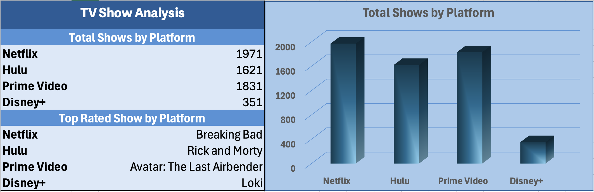

# M0 Business Data Analysis Final Project
<p align="center">
 Streaming platforms rose to the top with their business model, attracting millions of concurrent subscribers. Netflix has been a dominating force in this sector of entertainment. However, many competing streaming platforms emerged, attempted to carve a space in this profitable sector. Disney+ is one of these competing forces, yet it has struggled considerably. 
</p>


## Business Understanding

### Business Problem
#### Why is Disney+ struggling to compete with other top streaming services?
 
### Industry
Marketing/Entertainment

### Company
<ins>Disney+</ins>, Netflix, Hulu, Prime Video

## Project Objectives

### Data Lifecycle
As a data analyst, I used each phase of the data life cycle to complete my work. This allowed me to stay focused on my task. For this task:

- I am presented with the business problem.
   - Aside from data collection, I also viewed news resources and overviews of the companies I would focus on.
     
- I collect the data (Dataset found on [Kaggle](https://www.kaggle.com/datasets/ruchi798/tv-shows-on-netflix-prime-video-hulu-and-disney)).
   - In this scenario, the data collected included categories like show titles, ratings, and whether the platforms held the media.
     
- I process the data.
   - With this dataset, I sorted/filtered specific columns and removed blank spaces. I also use functions to pull key metrics.
     
- I analyze the data.
   - With a clean dataset and metrics, I pull insights and combine them with my knowledge on the subject.
     
- I create visuals to present the data.
   - To better articulate my findings, I create visuals that drive my conclusions home.

***

### Data Types
Explain the data types in the dataset (e.g., numeric/non-numeric, quantitative/qualitative, discrete/continuous).

The data I worked with included:
- show title
- IMDb Ratings
- Rotten Tomatoes Ratings
- Whether or not a platform had the show available, or platform availability, for:
   - Netflix
   - Hulu
   - Prime Video
   - Disney+
- Stock Price Data

<p align="center">
The types of these different data categories were mainly consistent, with some exceptions. Most of the data was qualitative, aside from the stock prices of Netflix and Disney+ being quantitative data. Even the data categories involving numeric ratings are considered qualitative, since they are used to show the characteristics of each show. Subsequently, while the show ratings and platform availability data entries were all in numeric form, show titles were the only non-numeric data entries. Finally, the show ratings are represented as continuous data, as they are indicative of a range of values that judge a show's value. Show titles, on the other hand, are discrete data entries, since they represent individual movies. 
</p>
 <p align="center">
 Platform availability, however, falls into an interesting distinction. While the data entries themselves are continuous, since they are measuring whether or not a streaming service have a show available, this data was used in a discrete manner, by totaling the count of shows a platform has available.
</p>

***
### Excel Analysis
<p align="center">
To begin working on the data in Excel, I had to adjust Excel parameters to detect the commas in the .csv file as cells. Once the .csv was transferred onto Excel, I was able to sort and filter the raw data to make it easier to work with. I filtered the blank entries and sorted the data in descending order based on the Rotten Tomatoes Scores column. Once this was done, I then used functions to calculate summary statistics. The data collected information on if a streaming service had a show by using 0 or 1. The data displayed 1 if it contained the show, and 0 if it did not. Therefore, I was able to use a COUNTIF function to count how many 1s appeared in the column for each streaming platform. This gave me a total count of shows that each platform had.
</p>
<p align="center">
Next, I wanted to find the top-rated show for each streaming service. To do this, I had to use a MATCH function within an INDEX function to find where the 1 appeared first in the sorted column, then display the title of the show that correlated with the matching cell. I did this for all streaming services while maintaining an absolute cell reference for the range of the show titles column.
</p>
<p align="center">
Finally, using the COUNTIF function results, I made a 3D bar graph to better visualize the differences in platform availability for each streaming service.
</p>



*** 

### Python Analysis

<p align="center">
In the Python section, I was able to work with the data using both the CSV and Pandas modules. I imported the modules, then I used a "with" statement to handle the .csv file properly.
</p>

```c++
with open('/Users/Marcy_Student/Desktop/m0-Final_Project/data/tv_shows.csv', 'r', encoding='utf-8') as file:
    reader = csv.reader(file,delimiter=',') 
    header = next(reader)
```

With the variables prepared, I was able to list the column names by printing the Header variable, and then used a "for" loop to sift through the rows in the list and print the first five rows. This was done by using an `Enumerate()` function to add a counter to each item in a list. Then, I simply used an inequality, i < 5, in order to limit the print to the first 5 rows.
```c++
for i, row in enumerate(reader):
        if i < 5:
            print('First 5 Rows:', row)
```
<p align="center">
Something to note: Since this was all done using the CSV module, these lines had to be done within the structure of the original "with" statement. This is to have all the functions work before the file is closed automatically at the end of the "with" statement.
</p>

***

Next, I used another "for" loop to the print the type of each column in the .csv by using `Type()` with each item in the header.
```c++
# Header Type
for item in header[0:-1]:
    print('Header Type', type(item))
```

<p align="center">
To begin sorting and filtering the data into digestible insights, I then used the Pandas module. After assigning a function to read the .csv to a variable, I used more inequalities to sort specific columns within the .csv. Using a 'greater than or equal to' sign to 1 for each streaming service column, I received booleans for each column, to see which streaming services contained the show. Then, I used a sum function to count up all the booleans, giving me the show availability of each streaming service.
</p>

```c++
# Show Availability Count of all Streaming Platforms
df = pd.read_csv('/Users/Marcy_Student/Desktop/m0-Final_Project/data/tv_shows.csv')

N_count = df['Netflix'] >= 1
H_count = df['Hulu'] >= 1
PV_count = df['Prime Video'] >= 1
D_count = df['Disney+'] >= 1

print('Netflix Show Availability:', N_count.sum())
print('Hulu Show Availability:',H_count.sum())
print('Prime Video Show Availability:', PV_count.sum())
print('Disney+ Show Availability:', D_count.sum())
```

<p align="center">
Finally, I applied the filter list back to the original data, so that I can only see the rows that contain 1 on the respective streaming service columns. An example is shown below:
</p>

```c++
# Filtered List of Netflix Show Availability Count
N_filter = df['Netflix'] >= 1
df_N_filter = df[N_filter]
print(df_N_filter)
```
<p align="center">
This was done for all four streaming platforms, returning the filtered list to the data.
</p>

## Conclusion:

Working with this data vastly improved my Python and presentation skills. 
Within Python, I was able to:
- Learn the CSV and Pandas Modules
- Use "for" and "with" statements properly
- Properly use loops in the manner of my choosing to work with large datasets
- Be able to explain the processes behind my lines of code

Within Excel, I was able to:
- Learn powerful functions, like INDEX and MATCH
- Use functions within functions to my benefit
- Present my findings using powerful visuals

Within Git/GitHub, I was able to:
- Get comfortable with the order of git add, commit, and push
- Proper file organization
- Comfortable use of the terminal when working inside repositories

### Next Steps

<p align="center">
Based on my findings, we can see that Disney+ has far fewer shows available on their streaming service than its competitors. While this alone is not a sole indication of Disney+'s shortcomings, I believe this to be a large issue that needs to be addressed to attract more concurrent subscribers to the platform.
</p>

> [!NOTE]
>  This is a fictitious scenario created by the GitHub author for academic purposes only.
